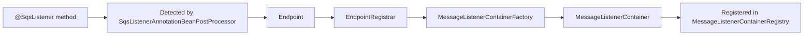
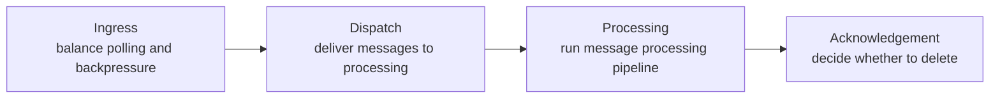
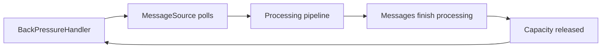
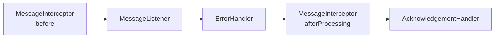
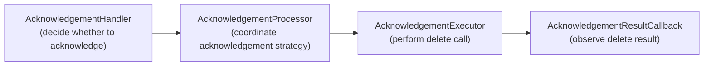

You write a method, add `@SqsListener`, and messages start arriving. It is easy to see that as a simple annotation-to-method shortcut. In practice, **Spring Cloud AWS SQS** assembles a listener container at startup and runs an async pipeline between the queue and your code at runtime.

That pipeline determines how messages are polled, dispatched, processed, and acknowledged. It shapes throughput, failure handling, and whether a listener invocation actually results in the message being deleted.

This post gives you a practical model for that system through two questions: what gets decided at startup, and what happens when a message is flowing at runtime.

For a broader architectural reference with diagrams, see the [architectural overview](...).

If you want to follow along, the [example project](#seeing-it-in-action) at the end of the post includes runnable scenarios for assembly, interception, error handling, and acknowledgement.

## Two phases: assembly and execution

The first distinction that makes the system easier to reason about is that some behavior is decided once at startup, and some only appears when messages are actually flowing.

These map to the **assembly** and **execution** phases. The framework first assembles listener behavior at startup, then executes message handling at runtime.

Suppose you write this listener method:

```java
@SqsListener("orders-queue")
public void handle(OrderCreated event) { // ... }
```

At startup, the framework turns the annotated method into the container and components that define how it will execute. This is the **assembly phase**.

The **execution phase** begins when the resulting containers start. Each container runs an async pipeline that polls SQS, dispatches messages for processing, and determines whether the result should be acknowledged.

The distinction is simple: startup assembles the runtime model, and runtime moves messages through it. That distinction matters because it frames the key question: is a given behavior determined at **assembly time**, or does it emerge as messages flow through the **runtime pipeline**?

In Spring Cloud AWS SQS, that question is especially useful because most behavioral variation is defined by the components assembled at startup, while the runtime flow itself follows a fixed sequence of stages through those components.

## Assembly: how listener behavior is built

Assembly is the startup process that turns an annotated method into a configured container with a known identity, queue bindings, and runtime configuration.

In simple terms, Spring detects your annotated method, turns it into a listener definition, creates a container for it, and registers that container so it can be started and managed as part of the application lifecycle. If you have used other Spring messaging projects such as **Spring for Apache Kafka**, this overall structure will feel familiar. What differs is the execution model underneath it.

Here is how each step maps to a component:

1. [`SqsListenerAnnotationBeanPostProcessor`](https://github.com/awspring/spring-cloud-aws/blob/main/spring-cloud-aws-sqs/src/main/java/io/awspring/cloud/sqs/annotation/SqsListenerAnnotationBeanPostProcessor.java) detects [`@SqsListener`](https://github.com/awspring/spring-cloud-aws/blob/main/spring-cloud-aws-sqs/src/main/java/io/awspring/cloud/sqs/annotation/SqsListener.java) annotations during bean post-processing
2. Each annotation becomes an [`Endpoint`](https://github.com/awspring/spring-cloud-aws/blob/main/spring-cloud-aws-sqs/src/main/java/io/awspring/cloud/sqs/config/Endpoint.java) that describes the listener: queues, method, and configuration
3. The [`EndpointRegistrar`](https://github.com/awspring/spring-cloud-aws/blob/main/spring-cloud-aws-sqs/src/main/java/io/awspring/cloud/sqs/config/EndpointRegistrar.java) delegates to [`MessageListenerContainerFactory`](https://github.com/awspring/spring-cloud-aws/blob/main/spring-cloud-aws-sqs/src/main/java/io/awspring/cloud/sqs/config/SqsMessageListenerContainerFactory.java) to create a container for each endpoint
4. Containers are registered in the [`MessageListenerContainerRegistry`](https://github.com/awspring/spring-cloud-aws/blob/main/spring-cloud-aws-sqs/src/main/java/io/awspring/cloud/sqs/listener/MessageListenerContainerRegistry.java), which manages their lifecycle

At a high level, the assembly flow looks like this:



By the time startup completes, each `@SqsListener` method has been turned into a container with a known identity, queue bindings, and a set of components that shape its behavior.

This is one of the main advantages of container-based messaging frameworks: they turn annotation-level intent into explicit runtime objects that can be inspected, configured, and managed consistently.

Once started, each container runs the async execution pipeline described below.

## Runtime: how the container pipeline determines message outcomes

Once the container starts, the question changes. You're no longer asking how the container was built. You are asking what happens to each message after it leaves SQS and before it disappears from the queue.

That runtime flow can be broken into four responsibilities.

- **Ingress**: balance polling and backpressure as messages enter the container
- **Dispatch**: route polled messages into processing according to the delivery strategy
- **Processing**: run the message processing pipeline and produce a result
- **Acknowledgement**: decide whether that result should delete the message from SQS

At this level, the runtime flow looks like this:



The concrete components behind these stages are assembled at startup inside the [`MessageListenerContainer`](https://github.com/awspring/spring-cloud-aws/blob/main/spring-cloud-aws-sqs/src/main/java/io/awspring/cloud/sqs/listener/MessageListenerContainer.java) by the [`ContainerComponentFactory`](https://github.com/awspring/spring-cloud-aws/blob/main/spring-cloud-aws-sqs/src/main/java/io/awspring/cloud/sqs/listener/ContainerComponentFactory.java), based on the configured [`ContainerOptions`](https://github.com/awspring/spring-cloud-aws/blob/main/spring-cloud-aws-sqs/src/main/java/io/awspring/cloud/sqs/listener/ContainerOptions.java) and queue semantics.

While the assembly phase resembles common patterns from Spring messaging projects, the Spring Cloud AWS SQS runtime pipeline is built around an asynchronous execution model powered by the AWS SDK’s `CompletableFuture`-based API.

The following sections walk through each stage.

### Ingress: polling under backpressure

At runtime, throughput is defined by the balance between polling behavior and how much work backpressure allows into the pipeline. Depending on configuration, multiple polls can stay in flight in parallel until the configured in-flight capacity is full.

This is one of the main controls over resource usage. If ingress is too permissive, the application can consume too much memory or processing capacity and degrade performance. If it is too restrictive, messages can accumulate in the queue while the application still has spare capacity. In asynchronous pipelines, throughput is usually limited less by how fast work enters the system than by how safely the rest of the pipeline can absorb it.

The ingress cycle looks like this at a high level:



At ingress, [`MessageSource`](https://github.com/awspring/spring-cloud-aws/blob/main/spring-cloud-aws-sqs/src/main/java/io/awspring/cloud/sqs/listener/source/MessageSource.java) controls ingress into the pipeline and converts SQS messages into Spring `Message` instances. It keeps polling while the [`BackPressureHandler`](https://github.com/awspring/spring-cloud-aws/blob/main/spring-cloud-aws-sqs/src/main/java/io/awspring/cloud/sqs/listener/backpressure/BackPressureHandler.java) allows more work to enter the container.

As each message finishes processing, capacity is released and the container can keep polling. Polling behavior is also configurable, including batch size and long polling settings that balance throughput and efficiency.

By default backpressure is mainly driven by internal in-flight capacity, but the mechanism is extensible and can also reflect signals such as downstream queue pressure or service availability.

### Dispatch: delivery strategy

Once messages enter the container, the next question is how they should be routed into processing. That is the role of the [`MessageSink`](https://github.com/awspring/spring-cloud-aws/blob/main/spring-cloud-aws-sqs/src/main/java/io/awspring/cloud/sqs/listener/sink/MessageSink.java).

Dispatch varies because not every message should enter processing the same way. Standard queues can fan out work in parallel. Batch listeners may want one or more batches delivered as a single unit. FIFO queues need dispatch that preserves ordering, often with message-group awareness.

The framework selects the concrete sink based on those semantics:

- [`FanOutMessageSink`](https://github.com/awspring/spring-cloud-aws/blob/main/spring-cloud-aws-sqs/src/main/java/io/awspring/cloud/sqs/listener/sink/FanOutMessageSink.java): parallel delivery for standard queues
- [`BatchMessageSink`](https://github.com/awspring/spring-cloud-aws/blob/main/spring-cloud-aws-sqs/src/main/java/io/awspring/cloud/sqs/listener/sink/BatchMessageSink.java): batch delivery for batch listeners
- [`OrderedMessageSink`](https://github.com/awspring/spring-cloud-aws/blob/main/spring-cloud-aws-sqs/src/main/java/io/awspring/cloud/sqs/listener/sink/OrderedMessageSink.java): sequential delivery when ordering must be preserved
- [`MessageGroupingSinkAdapter`](https://github.com/awspring/spring-cloud-aws/blob/main/spring-cloud-aws-sqs/src/main/java/io/awspring/cloud/sqs/listener/sink/adapter/MessageGroupingSinkAdapter.java): FIFO-aware delivery based on message groups

Most users never interact with the sink directly, but it is a key part of the runtime design. Dispatch can vary by queue and listener semantics while the rest of the processing model stays the same. 

Sinks are composable, and behaviors can be layered, for example by combining an `OrderedMessageSink`, a [`MessageVisibilityExtendingSinkAdapter`](https://github.com/awspring/spring-cloud-aws/blob/main/spring-cloud-aws-sqs/src/main/java/io/awspring/cloud/sqs/listener/sink/adapter/MessageVisibilityExtendingSinkAdapter.java), and a `MessageGroupingSinkAdapter`.

### Processing: producing a result

Once a message enters processing, the framework runs it through a chain that can intercept the message, invoke the listener method, handle errors, and decide whether the result should move into acknowledgement.

That chain is built in stages:



Here is how those stages map to the main runtime components:

- [`MessageInterceptor`](https://github.com/awspring/spring-cloud-aws/blob/main/spring-cloud-aws-sqs/src/main/java/io/awspring/cloud/sqs/listener/interceptor/MessageInterceptor.java) can observe or transform the message before listener invocation
- [`MessageListener`](https://github.com/awspring/spring-cloud-aws/blob/main/spring-cloud-aws-sqs/src/main/java/io/awspring/cloud/sqs/listener/MessageListener.java) invokes the method behind your `@SqsListener`
- [`ErrorHandler`](https://github.com/awspring/spring-cloud-aws/blob/main/spring-cloud-aws-sqs/src/main/java/io/awspring/cloud/sqs/listener/errorhandler/ErrorHandler.java) determines how listener failures are handled and whether they should still propagate
- [`MessageInterceptor.afterProcessing(...)`](https://github.com/awspring/spring-cloud-aws/blob/main/spring-cloud-aws-sqs/src/main/java/io/awspring/cloud/sqs/listener/interceptor/MessageInterceptor.java) observes the final result, including any exception
- [`AcknowledgementHandler`](https://github.com/awspring/spring-cloud-aws/blob/main/spring-cloud-aws-sqs/src/main/java/io/awspring/cloud/sqs/listener/acknowledgement/handler/AcknowledgementHandler.java) is the bridge to the next stage, deciding whether that result should move into acknowledgement

These components are available in synchronous and asynchronous variants. Using the asynchronous variants enables an end-to-end non-blocking pipeline. The framework automatically adapts both types into the pipeline without requiring any user configuration.

At this stage, processing has produced a result, determined whether it should move into acknowledgement, and released backpressure capacity.

### Acknowledgement: turning processing into deletion

A listener finishing successfully is not the same as a message being removed from the queue. Processing and deletion are separate concerns, and that gap is where operational surprises often appear.

If acknowledgement falls behind, completed messages can accumulate waiting for deletion. That increases the chance of visibility timeouts expiring before the delete call happens, which can lead to redelivery, duplicate work, and degraded performance.

At a high level, the acknowledgement path looks like this:



At the end of the processing pipeline the [`AcknowledgementHandler`](https://github.com/awspring/spring-cloud-aws/blob/main/spring-cloud-aws-sqs/src/main/java/io/awspring/cloud/sqs/listener/acknowledgement/handler/AcknowledgementHandler.java) has decided whether the result should move into acknowledgement. If the result should not be acknowledged, the message does not enter the acknowledgement stage, and SQS makes it visible again after the visibility timeout expires.

When a message does move into acknowledgement, the [`AcknowledgementProcessor`](https://github.com/awspring/spring-cloud-aws/blob/main/spring-cloud-aws-sqs/src/main/java/io/awspring/cloud/sqs/listener/acknowledgement/AcknowledgementProcessor.java) applies the acknowledgement strategy according to configuration and queue semantics:

- For **standard queues**, acknowledgements are batched by default and executed in parallel based on configurable batch thresholds and acknowledgement schedule.
- For **FIFO queues**, acknowledgements respect message-group ordering: they can run in ordered parallel batches across groups, or synchronously after each message when out-of-order reprocessing must be avoided.

The actual delete call is performed by the [`AcknowledgementExecutor`](https://github.com/awspring/spring-cloud-aws/blob/main/spring-cloud-aws-sqs/src/main/java/io/awspring/cloud/sqs/listener/acknowledgement/AcknowledgementExecutor.java). Its result can be observed through [`AcknowledgementResultCallback`](https://github.com/awspring/spring-cloud-aws/blob/main/spring-cloud-aws-sqs/src/main/java/io/awspring/cloud/sqs/listener/acknowledgement/AcknowledgementResultCallback.java), including partial acknowledgement failures reported as [`SqsAcknowledgementException`](https://github.com/awspring/spring-cloud-aws/blob/main/spring-cloud-aws-sqs/src/main/java/io/awspring/cloud/sqs/SqsAcknowledgementException.java).


This gives the container an acknowledgement model tailored to each queue type, balancing efficiency, ordering guarantees, observability, and extensibility for custom recovery strategies.

At that point, the overall shape of the runtime model is visible: messages enter through controlled ingress, are dispatched according to queue semantics, move through a processing chain that produces an outcome, and only then pass into acknowledgement. The value of this breakdown is not just that it names internal components, but that it turns `@SqsListener` from a single abstraction into a sequence of responsibilities.

## The async execution model

At runtime, SQS interaction is mostly I/O-bound. Polling is a network call, and acknowledgement eventually becomes a delete request back to SQS. In a synchronous design, threads would spend much of their time waiting on those operations, so throughput would be tied more closely to thread count.

Spring Cloud AWS SQS is built on [`SqsAsyncClient`](https://sdk.amazonaws.com/java/api/latest/software/amazon/awssdk/services/sqs/SqsAsyncClient.html), where operations such as `receiveMessage()` and `deleteMessageBatch()` return `CompletableFuture`. That shifts the container away from a thread-per-message design and toward an in-flight work model.

As a result, maxConcurrentMessages is not just a concurrency knob. It is one of the main controls over how much work the container allows into the pipeline at once. That affects how many polls the container can keep in flight in parallel, and how much pressure is placed on downstream processing and acknowledgement.

That same async model is what makes the ingress, processing, and acknowledgement stages composable without tying throughput directly to blocked threads.

## Seeing it in action

The [example project](https://github.com/tomazfernandes/tomazfernandes-dev/tree/main/examples/from-sqslistener-to-your-method) makes these stages concrete through a set of toggleable scenarios. It runs with Docker only, so you do not need a local Java setup.

- `make run-assembly`: logs container metadata at startup
- `make run-interceptor`: shows before/after interceptor hooks around each message
- `make run-error-handler`: shows failure handling and SQS redelivery
- `make run-ack-callback`: shows acknowledgement results after delete requests
- `make run-all`: runs all scenarios together

## Takeaways

`@SqsListener` looks simple on the surface, but behind it Spring Cloud AWS SQS assembles a container at startup and runs each message through an async runtime pipeline.

Once that model is clear, the runtime becomes easier to reason about as a sequence of responsibilities:

- **Assembly time** defines how the listener is materialized: which queues it binds to, which components and configuration it is built with, and how it is registered in the application lifecycle.
- **Ingress** balances polling and backpressure so the container can consume from SQS without overrunning the rest of the pipeline.
- **Dispatch** determines how messages enter processing for different queue and listener semantics, without changing the overall runtime model.
- **Processing** shapes the result through a pipeline around the listener that can intercept, transform, handle errors, and decide whether the result should move into acknowledgement.
- **Acknowledgement** turns that result into the actual delete flow, with consequences for batching, ordering, redelivery, and performance.

Most users do not need to think about these internals every day. But this breakdown makes it easier to understand how listener behavior is assembled, how message outcomes are determined, and where the framework’s extension points fit.

For the full architectural reference, including the original diagrams and component map, see the [architectural overview](https://github.com/awspring/spring-cloud-aws/blob/main/spring-cloud-aws-sqs/README.md). For the user-facing module reference, including configuration and runtime options, see the [Spring Cloud AWS SQS documentation](https://docs.awspring.io/spring-cloud-aws/docs/4.0.0/reference/html/index.html#sqs-integration).