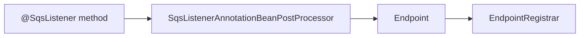
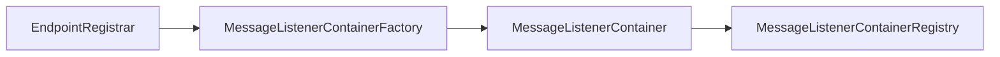
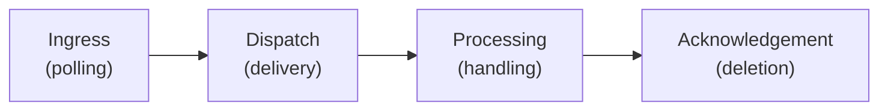
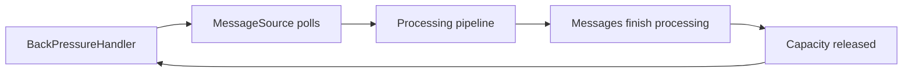
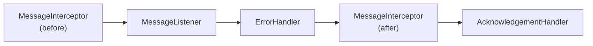
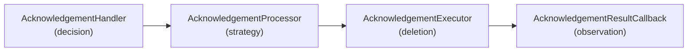

You write a method, add `@SqsListener`, and messages start arriving. It is easy to see that as a simple annotation-to-method shortcut.

In practice, **Spring Cloud AWS SQS** assembles a listener container at startup based on that annotation, and at runtime the container holds an async pipeline between the queue and your code.

**That pipeline controls how messages are polled, dispatched, processed, and acknowledged.** It influences throughput, failure handling, and whether processing actually results in the message being removed from the queue.

Making it look simple is exactly what a framework is supposed to do. **Understanding what happens underneath gives you leverage for the hard parts.**

This post builds a practical model of that system by showing how `@SqsListener` annotations become configured containers, how the runtime pipeline shapes message outcomes, and which concrete components implement each stage.

<details>
<summary>Companion resources</summary>

- [Architectural overview](https://github.com/awspring/spring-cloud-aws/blob/main/spring-cloud-aws-sqs/README.md): A deeper reference with diagrams in the Spring Cloud AWS repository.
- [Example project](https://github.com/tomazfernandes/tomazfernandes-dev/tree/main/examples/from-sqslistener-to-your-method): Runnable scenarios for assembly, interception, error handling, and acknowledgement; also a playground for experimenting with the framework.

</details>

<details>
<summary>Table of contents</summary>

- [Two phases: assembly and runtime](#two-phases-assembly-and-runtime)
- [Assembly: how listener behavior is built](#assembly-how-listener-behavior-is-built)
- [Runtime: how the container pipeline shapes message outcomes](#runtime-how-the-container-pipeline-shapes-message-outcomes)
  - [Ingress: polling under backpressure](#ingress-polling-under-backpressure)
  - [Dispatch: delivery strategy](#dispatch-delivery-strategy)
  - [Processing: handling the message](#processing-handling-the-message)
  - [Acknowledgement: turning processing into deletion](#acknowledgement-turning-processing-into-deletion)
- [The async runtime model](#the-async-runtime-model)
- [Seeing it in action](#seeing-it-in-action)
- [Takeaways](#takeaways)

</details>

## Two phases: assembly and runtime

To start building this model, the first useful distinction is between **assembly** and **runtime**.

Suppose you write this listener method:

```java
@SqsListener("orders-queue")
public void handle(OrderCreated event) { /* ... */ }
```

In the **assembly phase**, the framework turns that method into a configured container with the components that define its runtime behavior. In the **runtime phase**, messages begin to flow through that container’s asynchronous pipeline.

## Assembly: how listener behavior is built

The assembly phase follows a common pattern in Spring messaging projects, with the work split across two parts of Spring startup.

During bean post-processing, [`SqsListenerAnnotationBeanPostProcessor`](https://github.com/awspring/spring-cloud-aws/blob/main/spring-cloud-aws-sqs/src/main/java/io/awspring/cloud/sqs/annotation/SqsListenerAnnotationBeanPostProcessor.java) **detects [`@SqsListener`](https://github.com/awspring/spring-cloud-aws/blob/main/spring-cloud-aws-sqs/src/main/java/io/awspring/cloud/sqs/annotation/SqsListener.java) annotations and turns each one into an [`Endpoint`](https://github.com/awspring/spring-cloud-aws/blob/main/spring-cloud-aws-sqs/src/main/java/io/awspring/cloud/sqs/config/Endpoint.java)** that describes the listener: queues, listener method, and configuration. These endpoints are then collected by the [`EndpointRegistrar`](https://github.com/awspring/spring-cloud-aws/blob/main/spring-cloud-aws-sqs/src/main/java/io/awspring/cloud/sqs/config/EndpointRegistrar.java).

At a high level, the first part of the assembly flow looks like this:



At this point, the listener has been described as an **endpoint**. The next step is to turn that endpoint into a container.

When `afterSingletonsInstantiated()` is invoked, the `EndpointRegistrar` processes the collected endpoints. For each endpoint, it resolves the [`MessageListenerContainerFactory`](https://github.com/awspring/spring-cloud-aws/blob/main/spring-cloud-aws-sqs/src/main/java/io/awspring/cloud/sqs/config/SqsMessageListenerContainerFactory.java) to use, creates the corresponding container, and registers it in the [`MessageListenerContainerRegistry`](https://github.com/awspring/spring-cloud-aws/blob/main/spring-cloud-aws-sqs/src/main/java/io/awspring/cloud/sqs/listener/MessageListenerContainerRegistry.java).

The second part of the assembly flow looks like this:



By the time startup completes, **each `@SqsListener` method is represented by a message listener container** with its own identity, queue bindings, and runtime configuration.

To customize the assembly phase, for example, setting a default factory or configuring endpoint registration, [`SqsListenerConfigurer`](https://github.com/awspring/spring-cloud-aws/blob/main/spring-cloud-aws-sqs/src/main/java/io/awspring/cloud/sqs/config/SqsListenerConfigurer.java) is the main entry point. It provides access to the `EndpointRegistrar` before endpoints are processed into containers.

## Runtime: how the container pipeline shapes message outcomes

If you have used other Spring messaging projects such as Spring for Apache Kafka, the assembly side of this model will feel familiar. **The runtime phase is where Spring Cloud AWS SQS takes a different approach.**

Typically, runtime behavior in these projects is centered in a single container class. In Spring Cloud AWS SQS, **the container runs a composable asynchronous pipeline** built around the AWS SDK’s [`SqsAsyncClient`](https://sdk.amazonaws.com/java/api/latest/software/amazon/awssdk/services/sqs/SqsAsyncClient.html).

At runtime, the focus shifts to how messages enter the container, move through the processing pipeline, and eventually get deleted or made visible again.

**That gives us a runtime model built around four responsibilities**:

- **Ingress**: balance polling and backpressure as messages enter the container
- **Dispatch**: route polled messages into processing according to the delivery strategy
- **Processing**: run the message through the processing pipeline
- **Acknowledgement**: decide and execute message deletion based on processing outcomes

At this level, the runtime flow looks like this:



The [`MessageListenerContainer`](https://github.com/awspring/spring-cloud-aws/blob/main/spring-cloud-aws-sqs/src/main/java/io/awspring/cloud/sqs/listener/MessageListenerContainer.java) uses the [`ContainerComponentFactory`](https://github.com/awspring/spring-cloud-aws/blob/main/spring-cloud-aws-sqs/src/main/java/io/awspring/cloud/sqs/listener/ContainerComponentFactory.java) to create the components used in these stages at startup.

### Ingress: polling under backpressure

At the ingress boundary, **throughput depends on the balance between polling and backpressure**. This is one of the main controls over resource usage: if ingress is too permissive, the application can consume too much memory or compute resources; if it is too restrictive, messages can accumulate in the queue even though the application could safely handle more messages.

The ingress cycle looks like this at a high level:



In Spring Cloud AWS SQS, the [`MessageSource`](https://github.com/awspring/spring-cloud-aws/blob/main/spring-cloud-aws-sqs/src/main/java/io/awspring/cloud/sqs/listener/source/MessageSource.java) controls ingress into the pipeline and converts SQS messages into Spring `Message` instances. It keeps polling as long as the [`BackPressureHandler`](https://github.com/awspring/spring-cloud-aws/blob/main/spring-cloud-aws-sqs/src/main/java/io/awspring/cloud/sqs/listener/backpressure/BackPressureHandler.java) signals that more messages can be admitted in flight.

Polling behavior is configurable, including batch size and long polling settings that balance throughput and efficiency. As long as backpressure allows and the queue has enough messages available, **multiple poll calls can stay in flight in parallel**. When a queue is empty, the framework falls back to a single-poll model for that queue. As messages finish processing, room opens up and the container can keep polling.

By default, **backpressure is mainly driven by internal in-flight capacity**, but the mechanism is composable and can be extended with other signals such as downstream queue pressure or service availability.

### Dispatch: delivery strategy

Once messages enter the container, the next question is how they should be delivered for processing. **Delivery rules vary by queue and listener type**: standard queues can fan out work in parallel; batch listeners may want one or more batches delivered as a single unit; FIFO queues need dispatch that preserves ordering while still allowing parallelism across message groups.

In Spring Cloud AWS SQS, [`MessageSink`](https://github.com/awspring/spring-cloud-aws/blob/main/spring-cloud-aws-sqs/src/main/java/io/awspring/cloud/sqs/listener/sink/MessageSink.java) components are responsible for applying that strategy reliably. When the container starts, the [`ContainerComponentFactory`](https://github.com/awspring/spring-cloud-aws/blob/main/spring-cloud-aws-sqs/src/main/java/io/awspring/cloud/sqs/listener/ContainerComponentFactory.java) selects and composes sink implementations based on queue semantics and configuration. For example:

- A standard queue listener gets a [`FanOutMessageSink`](https://github.com/awspring/spring-cloud-aws/blob/main/spring-cloud-aws-sqs/src/main/java/io/awspring/cloud/sqs/listener/sink/FanOutMessageSink.java), which delivers each message to the processing pipeline in parallel. This is why a single `@SqsListener` can process multiple messages concurrently without any threading configuration.
- A FIFO queue listener gets a [`MessageGroupingSinkAdapter`](https://github.com/awspring/spring-cloud-aws/blob/main/spring-cloud-aws-sqs/src/main/java/io/awspring/cloud/sqs/listener/sink/adapter/MessageGroupingSinkAdapter.java) composed with an [`OrderedMessageSink`](https://github.com/awspring/spring-cloud-aws/blob/main/spring-cloud-aws-sqs/src/main/java/io/awspring/cloud/sqs/listener/sink/OrderedMessageSink.java), which partitions messages by group and enforces sequential delivery within each group, preserving ordering while still allowing parallelism across groups.
- A batch listener gets a [`BatchMessageSink`](https://github.com/awspring/spring-cloud-aws/blob/main/spring-cloud-aws-sqs/src/main/java/io/awspring/cloud/sqs/listener/sink/BatchMessageSink.java), which delivers them as a single unit to the listener method.

**Sinks and adapters share the same interface** and can be composed without changing the upstream source or downstream processing pipeline.

### Processing: handling the message

Message processing involves several connected concerns. A message may need to be enriched with headers, failures in listener logic may trigger fallback behavior, intermediate outcomes may need to be observed, and the result of these steps determines whether the message should be acknowledged or redelivered.

In Spring Cloud AWS SQS, **the message processing stage is structured as an inner processing pipeline**. Each stage in that pipeline is built around a user-provided component that can influence the next.

At a high level, the processing pipeline is structured like this:



Each stage can observe, transform, or react to the current processing state before passing control to the next:

- [`MessageInterceptor`](https://github.com/awspring/spring-cloud-aws/blob/main/spring-cloud-aws-sqs/src/main/java/io/awspring/cloud/sqs/listener/interceptor/MessageInterceptor.java) (before): can enrich the message with headers or validate preconditions before the listener runs
- [`MessageListener`](https://github.com/awspring/spring-cloud-aws/blob/main/spring-cloud-aws-sqs/src/main/java/io/awspring/cloud/sqs/listener/MessageListener.java): invokes the method behind `@SqsListener`, where the actual business logic runs
- [`ErrorHandler`](https://github.com/awspring/spring-cloud-aws/blob/main/spring-cloud-aws-sqs/src/main/java/io/awspring/cloud/sqs/listener/errorhandler/ErrorHandler.java): catches listener exceptions and decides whether to swallow, transform, or propagate them, which directly affects whether the message gets acknowledged or redelivered
- [`MessageInterceptor`](https://github.com/awspring/spring-cloud-aws/blob/main/spring-cloud-aws-sqs/src/main/java/io/awspring/cloud/sqs/listener/interceptor/MessageInterceptor.java) (after): sees the final outcome including any exception, making it a natural point for logging, metrics, or cleanup
- [`AcknowledgementHandler`](https://github.com/awspring/spring-cloud-aws/blob/main/spring-cloud-aws-sqs/src/main/java/io/awspring/cloud/sqs/listener/acknowledgement/handler/AcknowledgementHandler.java): bridges the processing result into the acknowledgement stage, deciding whether the message should be deleted or left for redelivery

While the pipeline is built on an asynchronous foundation, **the framework accepts combinations of synchronous and asynchronous variants of these components** without extra configuration. Asynchronous variants enable an end-to-end non-blocking pipeline, while synchronous ones are adapted on the fly to a message-per-thread or batch-per-thread model.

Once the final stage of the processing pipeline completes, backpressure capacity is released. **The message then either proceeds to acknowledgement or becomes visible again after the visibility timeout.**

### Acknowledgement: turning processing into deletion

As the message moves through the previous stages, it still sits in the queue, invisible until the visibility timeout expires. **Acknowledgement is the stage that turns processing results into actual deletion.** That mechanism has to balance several cross-cutting concerns at once: efficiency, throughput, ordering guarantees, observability, and extensibility.

**Acknowledgement performance must keep up with polling and processing throughput.** If it falls behind, completed messages can accumulate waiting for deletion. That increases the chance of visibility timeouts expiring before the delete call happens, which can lead to redelivery, duplicate work, and degraded performance.

In Spring Cloud AWS SQS, the acknowledgement flow is split across four main components:



The [`AcknowledgementHandler`](https://github.com/awspring/spring-cloud-aws/blob/main/spring-cloud-aws-sqs/src/main/java/io/awspring/cloud/sqs/listener/acknowledgement/handler/AcknowledgementHandler.java) in the final stage of the processing pipeline decides whether a message should proceed to deletion or stay in the queue for redelivery. If it should be acknowledged, **the [`AcknowledgementProcessor`](https://github.com/awspring/spring-cloud-aws/blob/main/spring-cloud-aws-sqs/src/main/java/io/awspring/cloud/sqs/listener/acknowledgement/AcknowledgementProcessor.java) applies a strategy that varies by queue type**:

- For **standard queues**, **acknowledgements are batched by default and executed in parallel** based on configurable batch thresholds and scheduling.
- For **FIFO queues**, acknowledgements respect message-group ordering: **they can run in ordered parallel batches across groups**, or **synchronously after each message** when out-of-order reprocessing must be avoided.

The [`AcknowledgementExecutor`](https://github.com/awspring/spring-cloud-aws/blob/main/spring-cloud-aws-sqs/src/main/java/io/awspring/cloud/sqs/listener/acknowledgement/AcknowledgementExecutor.java) issues the actual delete calls, which can succeed fully, fail partially, or fail completely. The [`AcknowledgementResultCallback`](https://github.com/awspring/spring-cloud-aws/blob/main/spring-cloud-aws-sqs/src/main/java/io/awspring/cloud/sqs/listener/acknowledgement/AcknowledgementResultCallback.java) observes the outcome, enabling custom recovery strategies as well as instrumentation. When partial failures occur, [`SqsAcknowledgementException`](https://github.com/awspring/spring-cloud-aws/blob/main/spring-cloud-aws-sqs/src/main/java/io/awspring/cloud/sqs/SqsAcknowledgementException.java) exposes which acknowledgements succeeded and which failed, so the callback can inspect and react to each case.

## The async runtime model

**At runtime, SQS interaction is mostly I/O-bound**: polling is a network call, and acknowledgement eventually becomes a delete request back to SQS. In a synchronous design, threads would spend much of their time waiting on those operations.

Spring Cloud AWS SQS is built on [`SqsAsyncClient`](https://sdk.amazonaws.com/java/api/latest/software/amazon/awssdk/services/sqs/SqsAsyncClient.html), where operations such as `receiveMessage()` and `deleteMessageBatch()` return `CompletableFuture`. That lets the container track in-flight work without tying progress to blocked threads. **Internally, `CompletableFuture` composition gives the framework declarative control over parallelism and non-blocking orchestration throughout the pipeline.**

The framework provides both synchronous and asynchronous variants of message processing components, and users can provide their own `TaskExecutor` for full control of what threads their code runs on. **This threading model allows users to write regular blocking code without worrying about the underlying async complexity**, and choose where and when to work with asynchronous code when it fits their use case.

## Seeing it in action

The [example project](https://github.com/tomazfernandes/tomazfernandes-dev/tree/main/examples/from-sqslistener-to-your-method) makes these stages concrete through a set of toggleable scenarios. It runs with Docker only, so you do not need a local Java setup.

- `make run-assembly`: logs container metadata at startup
- `make run-interceptor`: shows before/after interceptor hooks around each message
- `make run-error-handler`: shows failure handling and SQS redelivery
- `make run-ack-callback`: shows acknowledgement results after delete requests
- `make run-all`: runs all scenarios together

## Takeaways

Spring Cloud AWS SQS aims at making `@SqsListener` simple to use, while underneath it is transparently assembling a container that handles ingress, dispatch, processing, and acknowledgement at runtime. **Each of these concerns is mapped to a dedicated set of components** that can be swapped or extended to adapt to queue semantics and user requirements.

With that model in mind, each layer gives a clear starting point for understanding or changing behavior:

- To customize how listeners are built and configured, the **assembly phase** and its components are the first candidates.
- If throughput is not matching expectations, the relevant layer is usually **ingress and backpressure**.
- To observe, enrich, or react to messages at different points, the **processing pipeline and its extension points** are the place to start.
- If messages are not being deleted or getting redelivered unexpectedly, that naturally points to the **acknowledgement flow**.

For the full architectural reference, including the original diagrams and component map, see the [architectural overview](https://github.com/awspring/spring-cloud-aws/blob/main/spring-cloud-aws-sqs/README.md). For the user-facing module reference, including configuration and runtime options, see the [Spring Cloud AWS SQS documentation](https://docs.awspring.io/spring-cloud-aws/docs/4.0.0/reference/html/index.html#sqs-integration).