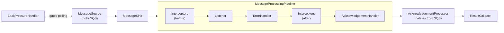

You write a method, add [`@SqsListener`](https://github.com/awspring/spring-cloud-aws/blob/main/spring-cloud-aws-sqs/src/main/java/io/awspring/cloud/sqs/annotation/SqsListener.java), and messages start arriving. From your code's perspective, the framework just calls your method with a deserialized payload. But between that annotation and your method, there's a full async pipeline: polling, dispatch, error recovery, acknowledgement, all running on infrastructure you never see.

Understanding what's actually running matters when something goes wrong, when you need to extend the pipeline, or when you want to tune its behavior. So let's open the hood.

## Two phases: assembly and execution

The module splits its work into two phases.

The **assembly phase** runs at startup. Spring detects `@SqsListener` annotations, creates listener endpoints, builds containers from a factory, and registers them in a lifecycle-managed registry. This is wiring: it turns annotations into live runtime objects.

The **execution phase** begins when those containers start. Each one runs an async pipeline that polls SQS, dispatches messages through a processing chain, and acknowledges them by deleting from the queue.

These phases are cleanly separated. The assembly machinery doesn't touch message processing, and the runtime pipeline doesn't care how it was assembled. Most of the interesting behavior lives in the execution phase.

## Assembly: from annotation to container

The assembly flow follows a short trail:

1. [`SqsListenerAnnotationBeanPostProcessor`](https://github.com/awspring/spring-cloud-aws/blob/main/spring-cloud-aws-sqs/src/main/java/io/awspring/cloud/sqs/annotation/SqsListenerAnnotationBeanPostProcessor.java) detects `@SqsListener` annotations during bean post-processing
2. Each annotation becomes an `Endpoint` describing the listener: queues, method, configuration
3. The `EndpointRegistrar` delegates to `SqsMessageListenerContainerFactory` to create a container for each endpoint
4. Containers are registered in the `MessageListenerContainerRegistry`, which manages their lifecycle

If you've used Spring for Apache Kafka, this structure is familiar. What differs is the execution model underneath.

By the time your application is ready, every `@SqsListener` has become a live container with a known identity, queue bindings, and configuration. The [example project](https://github.com/tomazfernandes/tomazfernandes-dev/tree/main/examples/sqs-architecture-overview) makes this visible: `make run-assembly` logs each container's ID, queue names, and settings like `maxConcurrentMessages` at startup.

## The async execution model

SQS is I/O-bound. Every poll is a network call. Every acknowledgement is a batch-delete call. A synchronous model would tie up threads waiting on responses, making concurrency expensive and throughput limited by pool size.

The pipeline is built on [`SqsAsyncClient`](https://sdk.amazonaws.com/java/api/latest/software/amazon/awssdk/services/sqs/SqsAsyncClient.html), where `receiveMessage()` and `deleteMessageBatch()` return `CompletableFuture`. Concurrency becomes a function of how many messages are allowed in-flight, not how many threads are available.

This changes how you think about tuning. When you set `maxConcurrentMessages`, you're not sizing a thread pool. You're setting a permit limit that controls how many messages the pipeline will hold at once, which in turn controls how aggressively the source polls SQS.

## The composable pipeline

When a container starts, it assembles its runtime components and begins polling. Each stage in the pipeline handles a single concern.

### MessageSource: polling and backpressure

The [`MessageSource`](https://github.com/awspring/spring-cloud-aws/blob/main/spring-cloud-aws-sqs/src/main/java/io/awspring/cloud/sqs/listener/source/MessageSource.java) polls SQS and converts responses into Spring `Message` objects. Before each poll, it requests permits from the [`BackPressureHandler`](https://github.com/awspring/spring-cloud-aws/blob/main/spring-cloud-aws-sqs/src/main/java/io/awspring/cloud/sqs/listener/backpressure/BackPressureHandler.java). If the pipeline is already at capacity, the permit request blocks and polling pauses. Permits are released when fewer messages are returned than requested, or when a message finishes processing. This creates a self-regulating loop: the source only polls as fast as the pipeline can consume.

If a poll fails, a configurable back-off policy kicks in. The container doesn't crash.

### MessageSink: dispatch strategy

The [`MessageSink`](https://github.com/awspring/spring-cloud-aws/blob/main/spring-cloud-aws-sqs/src/main/java/io/awspring/cloud/sqs/listener/sink/MessageSink.java) takes the polled batch and dispatches it into the processing pipeline. The framework selects the right sink based on your configuration: `FanOutMessageSink` for parallel processing on standard queues, `BatchMessageSink` for batch listeners, `OrderedMessageSink` for sequential processing, or `MessageGroupingSinkAdapter` for FIFO queues. You rarely interact with the sink directly, but it's the reason the same processing pipeline supports fan-out, batch, and ordered delivery without changes to the stages downstream.

### MessageProcessingPipeline: the processing chain

The [`MessageProcessingPipeline`](https://github.com/awspring/spring-cloud-aws/blob/main/spring-cloud-aws-sqs/src/main/java/io/awspring/cloud/sqs/listener/pipeline/MessageProcessingPipeline.java) is where your message actually gets processed. It chains together stages that execute in a fixed order, each handling a distinct concern. These are the stages the reader is most likely to interact with.

**Interceptors (before processing)**

[`MessageInterceptor`](https://github.com/awspring/spring-cloud-aws/blob/main/spring-cloud-aws-sqs/src/main/java/io/awspring/cloud/sqs/listener/interceptor/MessageInterceptor.java) implementations run before your listener method. They receive the message and return it (potentially modified), forming a chain. Typical uses: adding correlation IDs to the MDC, starting metric timers, enriching headers.

`MessageInterceptor` beans are auto-detected. Adding one is as simple as declaring a `@Component`.

**Listener invocation**

Your `@SqsListener` method runs here. If it completes normally, the message continues toward acknowledgement. If it throws, the exception propagates to the error handler.

**Error handling**

The [`ErrorHandler`](https://github.com/awspring/spring-cloud-aws/blob/main/spring-cloud-aws-sqs/src/main/java/io/awspring/cloud/sqs/listener/errorhandler/ErrorHandler.java) receives the original message and the exception. By default, the exception propagates, which means the message won't be acknowledged and SQS will redeliver it after the visibility timeout expires.

Custom error handlers let you control the failure policy: suppress the error so acknowledgement proceeds, route to a dead-letter queue, or apply conditional logic. Like interceptors, `ErrorHandler` beans are auto-detected.

**Interceptors (after processing)**

The same interceptor chain runs again with an `afterProcessing` callback that receives both the message and any exception. This is where you close the execution envelope: stop timers, log outcomes, clean up thread-local state.

**Acknowledgement handling**

The [`AcknowledgementHandler`](https://github.com/awspring/spring-cloud-aws/blob/main/spring-cloud-aws-sqs/src/main/java/io/awspring/cloud/sqs/listener/acknowledgement/handler/AcknowledgementHandler.java) decides whether to acknowledge based on the configured `AcknowledgementMode`:

- `ON_SUCCESS` (default): acknowledge only if processing succeeded
- `ALWAYS`: acknowledge regardless of outcome
- `MANUAL`: skip automatic acknowledgement, letting the listener control it

### AcknowledgementProcessor: deletion from SQS

The [`AcknowledgementProcessor`](https://github.com/awspring/spring-cloud-aws/blob/main/spring-cloud-aws-sqs/src/main/java/io/awspring/cloud/sqs/listener/acknowledgement/AcknowledgementProcessor.java) executes the actual SQS deletion. In SQS, acknowledging a message means deleting it from the queue. The processor batches delete requests and sends them asynchronously.

The handler decides *whether* to acknowledge. The processor handles *how*: batching, timing, retries. Separating these concerns lets you change the policy without touching the mechanics.

### AcknowledgementResultCallback: observability

The [`AcknowledgementResultCallback`](https://github.com/awspring/spring-cloud-aws/blob/main/spring-cloud-aws-sqs/src/main/java/io/awspring/cloud/sqs/listener/acknowledgement/AcknowledgementResultCallback.java) fires after the delete call succeeds or fails. Use it to confirm message removal, emit metrics, or alert on failures. Unlike interceptors and error handlers, this callback is not auto-detected: you register it on the container factory.

## Seeing it in action

The [example project](https://github.com/tomazfernandes/tomazfernandes-dev/tree/main/examples/sqs-architecture-overview) makes each pipeline stage observable through toggleable scenarios (Docker only, no local Java required):

- `make run-assembly`: container metadata at startup
- `make run-interceptor`: before/after hooks wrapping each message
- `make run-error-handler`: failure handling and SQS redelivery
- `make run-ack-callback`: delete confirmation from SQS
- `make run-all`: all scenarios at once

## Takeaways

`@SqsListener` is the entry point, but the system behind it is a two-phase architecture with a composable async pipeline. Each stage (polling, dispatch, interception, listener invocation, error handling, acknowledgement) is a replaceable component behind a well-defined interface.

Knowing the pipeline gives you practical leverage:

- **Debug**: a message that reappears after processing is an acknowledgement issue, not a listener issue. Knowing which stage owns which concern narrows the search
- **Extend**: interceptors for cross-cutting concerns, error handlers for failure policies, ack callbacks for observability. These are the intended seams
- **Configure**: `maxConcurrentMessages` controls backpressure permits, `acknowledgementMode` controls the ack handler, and the sink follows from your queue type
- **Reason**: the concurrency model is permit-based, not thread-based. Backpressure and throughput follow from in-flight capacity, not pool sizing

The common case stays simple: write a listener, let the framework handle the rest. The pipeline is there for when simple isn't enough.
