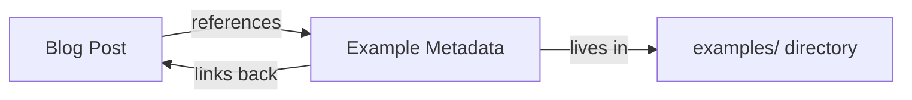

## Why Astro?

Astro is a great fit for technical blogs. It ships zero JavaScript by default, supports Markdown content collections with type-safe schemas, and has built-in Shiki syntax highlighting.

This blog is fully static — no server-side rendering, no client-side framework. Just HTML, CSS, and the occasional sprinkle of client-side JS (like Mermaid diagrams).

## Content Architecture

Posts and examples are separate content collections. Posts can reference examples, and examples can link back to posts. This keeps the writing focused while making the runnable code easy to find.



## Syntax Highlighting

Shiki handles code blocks at build time, generating CSS for both light and dark themes:

```java
@Bean
public SqsMessageListenerContainerFactory<Object> defaultSqsListenerContainerFactory() {
    return SqsMessageListenerContainerFactory
        .builder()
        .sqsAsyncClient(sqsAsyncClient())
        .build();
}
```

## What's Next

More posts about Spring Boot, SQS, observability, and distributed systems. Each one backed by runnable examples you can clone and try yourself.
