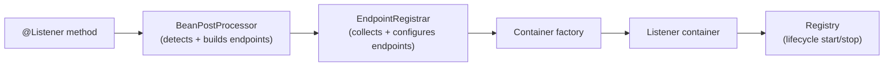
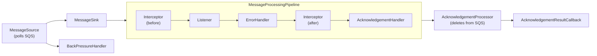

This post outlines common constraints production message consumers have to handle, then walks through the Spring Cloud AWS SQS integration architecture to frame a two-phase model: startup assembly and runtime execution.

We'll express the "receive, handle, acknowledge" loop as a staged runtime, making orchestration explicit and composable, then connect each stage back to those requirements.

It's a companion to the [architectural overview](https://github.com/awspring/spring-cloud-aws/blob/main/spring-cloud-aws-sqs/README.md) in the Spring Cloud AWS repository, which includes diagrams and a component reference.

## What production consumers need to account for

At a glance, consuming messages looks simple: receive, handle, acknowledge. In production, most of the complexity comes from the constraints around that loop.

Such constraints can be grouped into three ownership layers:
- **Broker/queueing system** owns delivery semantics such as redelivery behavior, dead-letter policies, and ordering guarantees.
- **Integration runtime** owns orchestration: receiving, dispatch, backpressure, acknowledgement calls, and instrumentation hooks.
- **Application** owns idempotency, side-effect safety. Many brokers provide at-least-once delivery, so duplicates must be assumed.

This post focuses on the constraints the *integration runtime* owns, using Spring Cloud AWS SQS as an example of how these constraints map onto a staged processing pipeline with explicit, composable components:

- **Ingress control:** how receiving is shaped and when it is paused.
- **Dispatch semantics:** how messages are dispatched under different modes (single, batch, ordered, grouped).
- **Execution envelope:** what wraps user code (interceptors, listener invocation) and how those hooks compose.
- **Failure policy:** what happens on exceptions and what that implies for retry and redelivery.
- **Acknowledgement flow:** when a message is considered “done” and how acknowledgement is executed and observed.

## How SQS broker semantics shape consumer constraints

At the broker layer, SQS (AWS' Simple Queue Service) defines delivery semantics through timeouts, queue policies, and network operations.

- **Polling over the network:** SQS is pulled, not pushed. Throughput is shaped by long polling, batch size, and how many receive requests you run in parallel.

- **Ordering and grouping:** Standard queues do not guarantee strict ordering. FIFO queues add message group semantics, which constrains how much parallelism you can safely apply.

- **Redelivery and dead-lettering:** retries are a consequence of visibility timeout and redelivery. Dead-letter behavior is configured through queue redrive policies.

- **Acknowledgement is deletion:** in SQS, acknowledging a message means deleting it. If processing succeeds but delete fails, the message may be delivered again.

- **Observability surface:** SQS exposes queue-level metrics such as depth and message age. Consumer-side signals (processing latency, delete outcomes, redelivery rates) need to be instrumented outside the queue.

## Spring messaging integrations: declarative wiring and lifecycle

Spring messaging integrations typically expose two levels of configuration:

Container-level settings control runtime behavior: concurrency, acknowledgement mode, backpressure, poll timeouts. These are the settings you change most often as your workload evolves.

Framework-level settings control how annotated methods are processed: message converters, method argument resolvers, payload validation. These tend to be set once and shared across all listeners in an application.

This is the “startup assembly” half of the two-phase model: build containers from configuration, then let the registry drive their lifecycle via Spring’s [`SmartLifecycle`](https://docs.spring.io/spring-framework/docs/current/javadoc-api/org/springframework/context/SmartLifecycle.html) contract.

An annotation-driven assembly phase wires everything at startup, tied to the application lifecycle. You declare intent (annotations and configuration), and the integration handles the wiring.

A `BeanPostProcessor` discovers listener annotations and creates endpoints using the registrar’s shared settings. A container factory turns endpoints into listener containers. A registry manages container lifecycle, so containers start and stop with the application lifecycle.

## How Spring Cloud AWS SQS maps onto this model

Spring Cloud AWS SQS follows this assembly pattern with its own components, documented in the [assembly phase](https://github.com/awspring/spring-cloud-aws/blob/main/spring-cloud-aws-sqs/README.md#assembly-phase) section of the architecture overview. Here’s how each assembly role maps to the module:

| Spring concept         | SQS module implementation |
|---|---|
| `@Listener` annotation | [@SqsListener](https://github.com/awspring/spring-cloud-aws/blob/main/spring-cloud-aws-sqs/src/main/java/io/awspring/cloud/sqs/annotation/SqsListener.java) |
| BeanPostProcessor      | [SqsListenerAnnotationBeanPostProcessor](https://github.com/awspring/spring-cloud-aws/blob/main/spring-cloud-aws-sqs/src/main/java/io/awspring/cloud/sqs/annotation/SqsListenerAnnotationBeanPostProcessor.java) |
| Endpoint Registrar     | [EndpointRegistrar](https://github.com/awspring/spring-cloud-aws/blob/main/spring-cloud-aws-sqs/src/main/java/io/awspring/cloud/sqs/config/EndpointRegistrar.java) |
| Container factory      | [SqsMessageListenerContainerFactory](https://github.com/awspring/spring-cloud-aws/blob/main/spring-cloud-aws-sqs/src/main/java/io/awspring/cloud/sqs/config/SqsMessageListenerContainerFactory.java) |
| Listener container     | [SqsMessageListenerContainer](https://github.com/awspring/spring-cloud-aws/blob/main/spring-cloud-aws-sqs/src/main/java/io/awspring/cloud/sqs/listener/SqsMessageListenerContainer.java) |
| Container options      | [SqsContainerOptions](https://github.com/awspring/spring-cloud-aws/blob/main/spring-cloud-aws-sqs/src/main/java/io/awspring/cloud/sqs/listener/SqsContainerOptions.java) |
| Registry               | [DefaultListenerContainerRegistry](https://github.com/awspring/spring-cloud-aws/blob/main/spring-cloud-aws-sqs/src/main/java/io/awspring/cloud/sqs/listener/DefaultListenerContainerRegistry.java) |

## Container execution phase

The container execution phase is where the SQS-specific runtime lives. The integration was [rewritten for Spring Cloud AWS 3.0](https://spring.io/blog/2023/05/02/announcing-spring-cloud-aws-3-0-0), building on the AWS SDK v2 asynchronous [SqsAsyncClient](https://sdk.amazonaws.com/java/api/latest/software/amazon/awssdk/services/sqs/SqsAsyncClient.html) so SQS operations do not block container threads and user-provided components (listeners, interceptors) can integrate in a non-blocking way.

When the registry starts a container, it assembles a [composable pipeline](https://github.com/awspring/spring-cloud-aws/blob/main/spring-cloud-aws-sqs/README.md#composable-pipeline) and starts polling SQS:

The components in this flow map the earlier constraints onto concrete mechanisms:

- **Ingress control:** [MessageSource](https://github.com/awspring/spring-cloud-aws/blob/main/spring-cloud-aws-sqs/src/main/java/io/awspring/cloud/sqs/listener/source/MessageSource.java) is responsible for polling SQS. [BackPressureHandler](https://github.com/awspring/spring-cloud-aws/blob/main/spring-cloud-aws-sqs/src/main/java/io/awspring/cloud/sqs/listener/backpressure/BackPressureHandler.java) applies backpressure by pausing/resuming polling based on criteria such as available in-flight capacity (`maxConcurrentMessages`).

- **Dispatch semantics:** [MessageSink](https://github.com/awspring/spring-cloud-aws/blob/main/spring-cloud-aws-sqs/src/main/java/io/awspring/cloud/sqs/listener/sink/MessageSink.java) selects the dispatch strategy, depending on the processing mode:

    - [FanOutMessageSink](https://github.com/awspring/spring-cloud-aws/blob/main/spring-cloud-aws-sqs/src/main/java/io/awspring/cloud/sqs/listener/sink/FanOutMessageSink.java): concurrent single-message processing
    - [BatchMessageSink](https://github.com/awspring/spring-cloud-aws/blob/main/spring-cloud-aws-sqs/src/main/java/io/awspring/cloud/sqs/listener/sink/BatchMessageSink.java): batch processing
    - [OrderedMessageSink](https://github.com/awspring/spring-cloud-aws/blob/main/spring-cloud-aws-sqs/src/main/java/io/awspring/cloud/sqs/listener/sink/OrderedMessageSink.java): sequential processing
    - [MessageGroupingSinkAdapter](https://github.com/awspring/spring-cloud-aws/blob/main/spring-cloud-aws-sqs/src/main/java/io/awspring/cloud/sqs/listener/sink/adapter/MessageGroupingSinkAdapter.java): FIFO per-group ordering

  Ordering is handled at dispatch time so the downstream processing pipeline can remain the same regardless of ordering constraints.

- **Execution envelope:** user code is invoked via [MessageListener](https://github.com/awspring/spring-cloud-aws/blob/main/spring-cloud-aws-sqs/src/main/java/io/awspring/cloud/sqs/listener/MessageListener.java), with [MessageInterceptor](https://github.com/awspring/spring-cloud-aws/blob/main/spring-cloud-aws-sqs/src/main/java/io/awspring/cloud/sqs/listener/interceptor/MessageInterceptor.java) providing before/after hooks around processing.

- **Failure policy:** [ErrorHandler](https://github.com/awspring/spring-cloud-aws/blob/main/spring-cloud-aws-sqs/src/main/java/io/awspring/cloud/sqs/listener/errorhandler/ErrorHandler.java) defines how processing failures are handled and whether they lead to retry/redelivery.

- **Acknowledgement flow:** [AcknowledgementHandler](https://github.com/awspring/spring-cloud-aws/blob/main/spring-cloud-aws-sqs/src/main/java/io/awspring/cloud/sqs/listener/acknowledgement/handler/AcknowledgementHandler.java) determines when a message should be acknowledged and triggers the delete through [AcknowledgementProcessor](https://github.com/awspring/spring-cloud-aws/blob/main/spring-cloud-aws-sqs/src/main/java/io/awspring/cloud/sqs/listener/acknowledgement/AcknowledgementProcessor.java), which reports outcomes via [AcknowledgementResultCallback](https://github.com/awspring/spring-cloud-aws/blob/main/spring-cloud-aws-sqs/src/main/java/io/awspring/cloud/sqs/listener/acknowledgement/AcknowledgementResultCallback.java).

These stages also interact with cross-cutting concerns:

- **Redelivery / visibility:** by default, messages are acknowledged on successful processing and left unacknowledged on exceptions, which means they may be redelivered after the visibility timeout expires. For sequential processing within FIFO message groups, the sink layer can be configured with a visibility-extending adapter (for example, [MessageVisibilityExtendingSinkAdapter](https://github.com/awspring/spring-cloud-aws/blob/main/spring-cloud-aws-sqs/src/main/java/io/awspring/cloud/sqs/listener/sink/adapter/MessageVisibilityExtendingSinkAdapter.java)) that extends visibility as part of the sequential dispatch flow.

- **Observability:** the module provides [Micrometer instrumentation](https://docs.awspring.io/spring-cloud-aws/docs/4.0.0/reference/html/index.html#observability-support) out of the box for both template and listener operations, covering metrics and tracing with customizable conventions.

- **Duplicates / idempotency:** the runtime assumes at-least-once delivery; idempotency is handled at the application boundary.

The runtime is assembled from small interfaces at container start, keeping the core pipeline stable while supporting multiple processing modes. Customization is primarily exposed through container configuration and extension points such as [SqsContainerOptions](https://github.com/awspring/spring-cloud-aws/blob/main/spring-cloud-aws-sqs/src/main/java/io/awspring/cloud/sqs/listener/SqsContainerOptions.java) and [ContainerComponentFactory](https://github.com/awspring/spring-cloud-aws/blob/main/spring-cloud-aws-sqs/src/main/java/io/awspring/cloud/sqs/listener/ContainerComponentFactory.java).

## Conclusion

In this post, we outlined some common messaging constraints by turning the “receive, handle, acknowledge” loop into an explicit **staged runtime**, where orchestration is expressed as composable stages with clear responsibilities.

Spring Cloud AWS SQS makes this model concrete and splits the architecture into two phases:

- **Startup assembly:** build endpoints and containers from annotations and shared configuration, then let the registry manage container lifecycle.
- **Runtime execution:** run a staged pipeline that owns the integration-layer orchestration: ingress control, dispatch, an execution envelope, failure policy, and acknowledgement flow.

If you want to dive deeper into the concrete component boundaries, the companion [architectural overview](https://github.com/awspring/spring-cloud-aws/blob/main/spring-cloud-aws-sqs/README.md) includes diagrams and a component reference.

For customization, the [reference docs](https://docs.awspring.io/spring-cloud-aws/docs/4.0.0/reference/html/index.html) cover the main extension points and configuration surface (container options, acknowledgement and error handling, interceptors, observability).