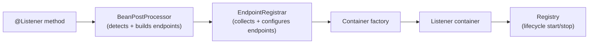
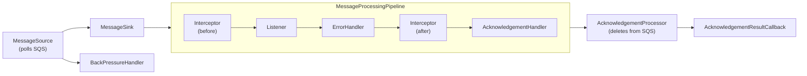

This post walks through the integration’s two-phase design: a familiar Spring assembly phase at startup, and a container execution phase built on the AWS SDK v2 asynchronous client for non-blocking polling and acknowledgement.

It's a companion to the [architectural overview](/sqs-architecture) in the Spring Cloud AWS repository, which includes diagrams and a component-level reference.

**Outline:**
- [Messaging concerns](#what-messaging-systems-need-to-account-for)
- [SQS semantics](#how-sqs-maps-to-messaging-concerns)
- [Spring messaging integrations: declarative wiring and lifecycle](#spring-messaging-integrations-declarative-wiring-and-lifecycle)
- [Spring Cloud AWS SQS assembly map](#how-spring-cloud-aws-sqs-maps-onto-this-model)
- [Container execution phase](#container-execution-phase)

## What messaging systems need to account for

Messaging can look simple: produce, consume, acknowledge. In practice, most of the complexity sits around the handler.

Most production consumers end up dealing with polling strategies, concurrency and backpressure, ordering, failure handling, acknowledgement, redelivery, observability, and idempotency. These controls interact and trade off against each other. For example, acknowledgement failures can lead to redelivery, redelivery without backpressure can overload a service, and ordering constraints limit concurrency.

A production-ready integration handles these cross-cutting concerns and exposes them through consistent configuration and extensible components, making runtime behavior explicit and adjustable.

## How SQS maps to messaging concerns

SQS expresses these concerns with its own vocabulary and constraints:

- **Polling strategies:** SQS is polled over the network. Throughput is shaped by long polling configuration, batch size, parallel receive requests.

- **Concurrency and backpressure:** throughput is bounded by in-flight capacity and how aggressively the consumer polls.

- **Ordering and grouping:** Standard queues do not guarantee strict order; FIFO queues introduce message group semantics to preserve order within a group.

- **Failures:** retries are a natural consequence of visibility timeout and redelivery; dead-letter behavior is typically configured in the queue through redrive policies.

- **Acknowledgement:** in SQS, "ack" is deleting the message. If processing succeeds but delete fails, it may be reprocessed.

- **Redelivery:** SQS uses a visibility timeout. If a message is not deleted before it expires, it becomes visible again and may be delivered again.

- **Observability and control:** SQS exposes queue-level metrics (for example, queue depth and message age). Consumer-side metrics (processing latency, delete outcomes, redelivery rates) usually need to be instrumented by the consumer/integration.

- **Duplicates and idempotency:** SQS is at-least-once, so consumers should assume duplicates and make processing idempotent. FIFO queues provide message deduplication within a deduplication window.

In SQS, several controls become time and network side effects: visibility timeout, delete calls, and polling shape both correctness and throughput.

## Spring messaging integrations: declarative wiring and lifecycle

Spring messaging integrations typically expose two levels of configuration:

Container-level settings control runtime behavior: concurrency, acknowledgement mode, backpressure, poll timeouts. These are the settings you change most often as your workload evolves.

Framework-level settings control how annotated methods are processed: message converters, method argument resolvers, payload validation. These tend to be set once and shared across all listeners in an application.

An annotation-driven assembly phase wires everything at startup, tied to the application lifecycle. You declare intent (annotations and configuration), and the integration handles the wiring.

A `BeanPostProcessor` discovers listener annotations and creates endpoints using the registrar’s shared settings. A container factory turns endpoints into listener containers. A registry manages container lifecycle, so containers start and stop with the application lifecycle.

## How Spring Cloud AWS SQS maps onto this model

Spring Cloud AWS SQS follows this assembly pattern with its own components, documented in the [assembly phase](/sqs-architecture#assembly-phase) section of the architecture overview. Here’s how each assembly role maps to the module:

| Spring concept         | SQS module implementation |
|---|---|
| `@Listener` annotation | [@SqsListener](https://github.com/awspring/spring-cloud-aws/blob/main/spring-cloud-aws-sqs/src/main/java/io/awspring/cloud/sqs/annotation/SqsListener.java) |
| BeanPostProcessor      | [SqsListenerAnnotationBeanPostProcessor](https://github.com/awspring/spring-cloud-aws/blob/main/spring-cloud-aws-sqs/src/main/java/io/awspring/cloud/sqs/annotation/SqsListenerAnnotationBeanPostProcessor.java) |
| Endpoint Registrar     | [EndpointRegistrar](https://github.com/awspring/spring-cloud-aws/blob/main/spring-cloud-aws-sqs/src/main/java/io/awspring/cloud/sqs/config/EndpointRegistrar.java) |
| Container factory      | [SqsMessageListenerContainerFactory](https://github.com/awspring/spring-cloud-aws/blob/main/spring-cloud-aws-sqs/src/main/java/io/awspring/cloud/sqs/config/SqsMessageListenerContainerFactory.java) |
| Listener container     | [SqsMessageListenerContainer](https://github.com/awspring/spring-cloud-aws/blob/main/spring-cloud-aws-sqs/src/main/java/io/awspring/cloud/sqs/listener/SqsMessageListenerContainer.java) |
| Container options      | [SqsContainerOptions](https://github.com/awspring/spring-cloud-aws/blob/main/spring-cloud-aws-sqs/src/main/java/io/awspring/cloud/sqs/listener/SqsContainerOptions.java) |
| Registry               | [DefaultListenerContainerRegistry](https://github.com/awspring/spring-cloud-aws/blob/main/spring-cloud-aws-sqs/src/main/java/io/awspring/cloud/sqs/listener/DefaultListenerContainerRegistry.java) |

## Container execution phase

The container execution phase is where the SQS-specific runtime lives. The SQS integration was [completely rewritten for Spring Cloud AWS 3.0](https://spring.io/blog/2023/05/02/announcing-spring-cloud-aws-3-0-0). 

To keep the container from stalling on network round trips, the runtime is built on the AWS SDK v2 asynchronous [SqsAsyncClient](https://sdk.amazonaws.com/java/api/latest/software/amazon/awssdk/services/sqs/SqsAsyncClient.html) for both polling and acknowledgement.

When the registry starts a container, it assembles a [composable pipeline](/sqs-architecture#composable-pipeline) and starts polling SQS:

The components in this flow map the earlier messaging concerns onto concrete mechanisms:

- **Concurrency + backpressure:** [BackPressureHandler](https://github.com/awspring/spring-cloud-aws/blob/main/spring-cloud-aws-sqs/src/main/java/io/awspring/cloud/sqs/listener/backpressure/BackPressureHandler.java) applies backpressure by pausing/resuming polling based on available in-flight capacity (`maxConcurrentMessages`).

- **Ordering + grouping:** [MessageSink](https://github.com/awspring/spring-cloud-aws/blob/main/spring-cloud-aws-sqs/src/main/java/io/awspring/cloud/sqs/listener/sink/MessageSink.java) selects the dispatch strategy: [FanOutMessageSink](https://github.com/awspring/spring-cloud-aws/blob/main/spring-cloud-aws-sqs/src/main/java/io/awspring/cloud/sqs/listener/sink/FanOutMessageSink.java) for concurrent single-message processing, [BatchMessageSink](https://github.com/awspring/spring-cloud-aws/blob/main/spring-cloud-aws-sqs/src/main/java/io/awspring/cloud/sqs/listener/sink/BatchMessageSink.java) for batch processing, [OrderedMessageSink](https://github.com/awspring/spring-cloud-aws/blob/main/spring-cloud-aws-sqs/src/main/java/io/awspring/cloud/sqs/listener/sink/OrderedMessageSink.java) for sequential processing, and [MessageGroupingSinkAdapter](https://github.com/awspring/spring-cloud-aws/blob/main/spring-cloud-aws-sqs/src/main/java/io/awspring/cloud/sqs/listener/sink/adapter/MessageGroupingSinkAdapter.java) for FIFO per-group ordering. Ordering is handled at dispatch time so the downstream processing pipeline can remain the same regardless of ordering constraints.

- **Handler execution:** user code is invoked via [MessageListener](https://github.com/awspring/spring-cloud-aws/blob/main/spring-cloud-aws-sqs/src/main/java/io/awspring/cloud/sqs/listener/MessageListener.java), with [MessageInterceptor](https://github.com/awspring/spring-cloud-aws/blob/main/spring-cloud-aws-sqs/src/main/java/io/awspring/cloud/sqs/listener/interceptor/MessageInterceptor.java) providing before/after hooks around processing.

- **Failures:** [ErrorHandler](https://github.com/awspring/spring-cloud-aws/blob/main/spring-cloud-aws-sqs/src/main/java/io/awspring/cloud/sqs/listener/errorhandler/ErrorHandler.java) defines how processing failures are handled and whether they lead to retry/redelivery.

- **Acknowledgement:** [AcknowledgementHandler](https://github.com/awspring/spring-cloud-aws/blob/main/spring-cloud-aws-sqs/src/main/java/io/awspring/cloud/sqs/listener/acknowledgement/handler/AcknowledgementHandler.java) determines when a message should be acknowledged and delegates to [AcknowledgementProcessor](https://github.com/awspring/spring-cloud-aws/blob/main/spring-cloud-aws-sqs/src/main/java/io/awspring/cloud/sqs/listener/acknowledgement/AcknowledgementProcessor.java), which performs the SQS delete.

- **Redelivery / visibility:** by default, messages are acknowledged on successful processing and left unacknowledged on exceptions, which means they may be redelivered after the visibility timeout expires. For sequential processing within FIFO message groups, the sink layer can be configured with a visibility-extending adapter (for example, [MessageVisibilityExtendingSinkAdapter](https://github.com/awspring/spring-cloud-aws/blob/main/spring-cloud-aws-sqs/src/main/java/io/awspring/cloud/sqs/listener/sink/adapter/MessageVisibilityExtendingSinkAdapter.java)) that extends visibility as part of the sequential dispatch flow.

- **Observability + control:** the module provides [Micrometer instrumentation](https://docs.awspring.io/spring-cloud-aws/docs/4.0.0/reference/html/index.html#observability-support) out of the box for both template and listener operations, covering metrics and tracing with customizable conventions.

- **Duplicates / idempotency:** the runtime assumes at-least-once delivery; idempotency is handled at the application boundary.

Each component is defined behind an interface and composed at container startup. This composition model supports different processing modes (single message, batch, ordered, FIFO) without rewriting the core pipeline. Custom implementations can be provided via [SqsContainerOptions](https://github.com/awspring/spring-cloud-aws/blob/main/spring-cloud-aws-sqs/src/main/java/io/awspring/cloud/sqs/listener/SqsContainerOptions.java) and [ContainerComponentFactory](https://github.com/awspring/spring-cloud-aws/blob/main/spring-cloud-aws-sqs/src/main/java/io/awspring/cloud/sqs/listener/ContainerComponentFactory.java).
