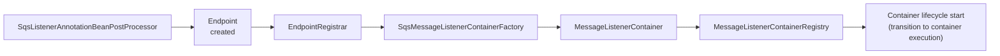
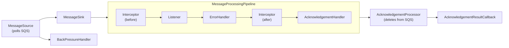

**What:** This module integrates Amazon SQS with Spring applications, providing both annotation-driven and manually instantiable message listeners backed by an asynchronous runtime pipeline.

**Why:** The SQS integration underwent a major redesign in Spring Cloud AWS 3.0 to address limitations in previous versions and build on AWS SDK v2's async API. It was [released as GA in 2023](https://spring.io/blog/2023/05/02/announcing-spring-cloud-aws-3-0-0).

**Who:** This document is meant for maintainers, contributors, and readers who want to understand the module's internal structure and design. It introduces the core mental model used throughout the module: an assembly phase at startup, and a container execution phase where messages are polled, processed, and acknowledged. It focuses on the high-level structure and provides shared terminology for discussing the module's flows and components.

## Two-Phase Architecture

The module is organized into two phases with different responsibilities:

- **Assembly phase**: At startup, Spring detects [@SqsListener](https://github.com/awspring/spring-cloud-aws/blob/main/spring-cloud-aws-sqs/src/main/java/io/awspring/cloud/sqs/annotation/SqsListener.java) annotations, creates listener endpoints, and wires [MessageListenerContainer](https://github.com/awspring/spring-cloud-aws/blob/main/spring-cloud-aws-sqs/src/main/java/io/awspring/cloud/sqs/listener/MessageListenerContainer.java) instances through a factory and registry. This follows the same high-level assembly pattern used by [Spring for Apache Kafka](https://docs.spring.io/spring-kafka/reference/) and other Spring Messaging projects.

- **Container execution phase**: When containers start, they run an asynchronous pipeline that polls SQS, invokes the listener, and acknowledges messages. This pipeline builds on AWS SDK v2's async API ([SqsAsyncClient](https://sdk.amazonaws.com/java/api/latest/software/amazon/awssdk/services/sqs/SqsAsyncClient.html)) and uses a composable component model, including adaptive backpressure controls. While reusing familiar Spring abstractions such as [MessageListener](https://github.com/awspring/spring-cloud-aws/blob/main/spring-cloud-aws-sqs/src/main/java/io/awspring/cloud/sqs/listener/MessageListener.java), the async processing pipeline is a module-specific design introduced in Spring Cloud AWS 3.0.

This separation keeps startup wiring concerns independent from message processing concerns, and makes the runtime pipeline easier to reason about and evolve without changing the assembly flow.

## Assembly Phase

The assembly phase wires listener containers at startup. The flow is:

1. [SqsListenerAnnotationBeanPostProcessor](https://github.com/awspring/spring-cloud-aws/blob/main/spring-cloud-aws-sqs/src/main/java/io/awspring/cloud/sqs/annotation/SqsListenerAnnotationBeanPostProcessor.java) detects [@SqsListener](https://github.com/awspring/spring-cloud-aws/blob/main/spring-cloud-aws-sqs/src/main/java/io/awspring/cloud/sqs/annotation/SqsListener.java) annotations during bean post-processing
2. For each annotation, it creates an [Endpoint](https://github.com/awspring/spring-cloud-aws/blob/main/spring-cloud-aws-sqs/src/main/java/io/awspring/cloud/sqs/config/Endpoint.java) describing the listener
3. Endpoints are registered with the [EndpointRegistrar](https://github.com/awspring/spring-cloud-aws/blob/main/spring-cloud-aws-sqs/src/main/java/io/awspring/cloud/sqs/config/EndpointRegistrar.java)
4. The registrar delegates to [SqsMessageListenerContainerFactory](https://github.com/awspring/spring-cloud-aws/blob/main/spring-cloud-aws-sqs/src/main/java/io/awspring/cloud/sqs/config/SqsMessageListenerContainerFactory.java) to create containers
5. Containers are registered in the [MessageListenerContainerRegistry](https://github.com/awspring/spring-cloud-aws/blob/main/spring-cloud-aws-sqs/src/main/java/io/awspring/cloud/sqs/listener/MessageListenerContainerRegistry.java), which manages their lifecycle

## Container Execution Phase

When the [MessageListenerContainerRegistry](https://github.com/awspring/spring-cloud-aws/blob/main/spring-cloud-aws-sqs/src/main/java/io/awspring/cloud/sqs/listener/MessageListenerContainerRegistry.java) starts its containers, each container assembles its processing pipeline and begins polling for messages. The [ContainerComponentFactory](https://github.com/awspring/spring-cloud-aws/blob/main/spring-cloud-aws-sqs/src/main/java/io/awspring/cloud/sqs/listener/ContainerComponentFactory.java) creates the runtime components and wires them together.

### Async execution model

SQS is inherently I/O-bound. Every poll is a network call to AWS, and every acknowledgement is a batch-delete call. A blocking model would tie up threads waiting on these responses.

The pipeline is built on [SqsAsyncClient](https://sdk.amazonaws.com/java/api/latest/software/amazon/awssdk/services/sqs/SqsAsyncClient.html), where `receiveMessage()` and `deleteMessageBatch()` both return `CompletableFuture`. This keeps polling and acknowledgement non-blocking and makes concurrency primarily a matter of configured in-flight capacity rather than thread availability.

### Composable Pipeline

The runtime is structured as a composable pipeline. Within each [listener container](https://github.com/awspring/spring-cloud-aws/blob/main/spring-cloud-aws-sqs/src/main/java/io/awspring/cloud/sqs/listener/AbstractPipelineMessageListenerContainer.java):

- [**MessageSource**](https://github.com/awspring/spring-cloud-aws/blob/main/spring-cloud-aws-sqs/src/main/java/io/awspring/cloud/sqs/listener/source/MessageSource.java): Polls SQS for messages and converts them to Spring [Message](https://docs.spring.io/spring-framework/docs/current/javadoc-api/org/springframework/messaging/Message.html) objects. Uses a [BackPressureHandler](https://github.com/awspring/spring-cloud-aws/blob/main/spring-cloud-aws-sqs/src/main/java/io/awspring/cloud/sqs/listener/backpressure/BackPressureHandler.java) to gate polling based on in-flight message capacity
- [**MessageSink**](https://github.com/awspring/spring-cloud-aws/blob/main/spring-cloud-aws-sqs/src/main/java/io/awspring/cloud/sqs/listener/sink/MessageSink.java): Dispatches messages to the processing pipeline. Composable component with implementations such as [FanOutMessageSink](https://github.com/awspring/spring-cloud-aws/blob/main/spring-cloud-aws-sqs/src/main/java/io/awspring/cloud/sqs/listener/sink/FanOutMessageSink.java) (single-message), [BatchMessageSink](https://github.com/awspring/spring-cloud-aws/blob/main/spring-cloud-aws-sqs/src/main/java/io/awspring/cloud/sqs/listener/sink/BatchMessageSink.java), [OrderedMessageSink](https://github.com/awspring/spring-cloud-aws/blob/main/spring-cloud-aws-sqs/src/main/java/io/awspring/cloud/sqs/listener/sink/OrderedMessageSink.java), and [MessageGroupingSinkAdapter](https://github.com/awspring/spring-cloud-aws/blob/main/spring-cloud-aws-sqs/src/main/java/io/awspring/cloud/sqs/listener/sink/adapter/MessageGroupingSinkAdapter.java) (FIFO)
- [**MessageProcessingPipeline**](https://github.com/awspring/spring-cloud-aws/blob/main/spring-cloud-aws-sqs/src/main/java/io/awspring/cloud/sqs/listener/pipeline/MessageProcessingPipeline.java): Chains together the stages that process each message:
    - [MessageInterceptor](https://github.com/awspring/spring-cloud-aws/blob/main/spring-cloud-aws-sqs/src/main/java/io/awspring/cloud/sqs/listener/interceptor/MessageInterceptor.java) - before/after processing hooks
    - [MessageListener](https://github.com/awspring/spring-cloud-aws/blob/main/spring-cloud-aws-sqs/src/main/java/io/awspring/cloud/sqs/listener/MessageListener.java) - invokes the user's [@SqsListener](https://github.com/awspring/spring-cloud-aws/blob/main/spring-cloud-aws-sqs/src/main/java/io/awspring/cloud/sqs/annotation/SqsListener.java) method
    - [ErrorHandler](https://github.com/awspring/spring-cloud-aws/blob/main/spring-cloud-aws-sqs/src/main/java/io/awspring/cloud/sqs/listener/errorhandler/ErrorHandler.java) - handles processing failures
    - [AcknowledgementHandler](https://github.com/awspring/spring-cloud-aws/blob/main/spring-cloud-aws-sqs/src/main/java/io/awspring/cloud/sqs/listener/acknowledgement/handler/AcknowledgementHandler.java) - triggers acknowledgement (deletion from SQS)
- [**AcknowledgementProcessor**](https://github.com/awspring/spring-cloud-aws/blob/main/spring-cloud-aws-sqs/src/main/java/io/awspring/cloud/sqs/listener/acknowledgement/AcknowledgementProcessor.java): Acknowledges processed messages by deleting them from SQS
- [**AcknowledgementResultCallback**](https://github.com/awspring/spring-cloud-aws/blob/main/spring-cloud-aws-sqs/src/main/java/io/awspring/cloud/sqs/listener/acknowledgement/AcknowledgementResultCallback.java): Notified after acknowledgement succeeds or fails

These components are assembled at container start and interact through well-defined interfaces, making it straightforward to swap or extend individual stages.

